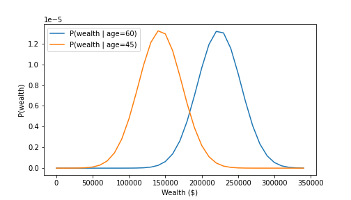
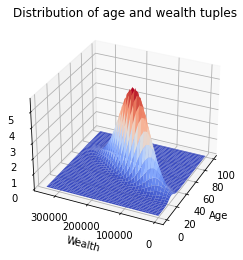
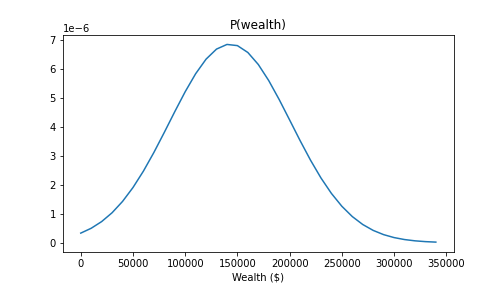
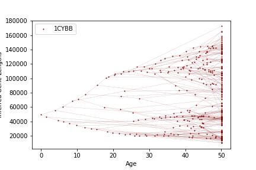

# `CanonicalForms`
`CanonicalForms` is a small library for manipulation, generation and simple analysis of canonical forms, with specialized support for working with gaussian models.

In short, a canonical form is a representation of a probability distribution, and they are useful for factorizing and simplifying probability distributions with sets of independent variables. The following is a demonstration of how and what it can do.


## Modelling our first gaussian and plotting likelihoods
This simple example sets up a normal distribution, and plots the density function.

```python
import CanonicalForms as cf
import matplotlib.pyplot as plt
import numpy as np

# Generating the canonical form of a univariate gaussian and plotting it
variance = 2
mean = 5
canonicalForm = cf.Canon.fromUniVariateGaussian(variableName="X", mean=mean, variance=variance)

domain = np.arange(-10, 10, 0.1)
plt.plot(domain, [canonicalForm.evaluatePDF({"X":x}) for x in domain])
plt.xlabel("x")
plt.ylabel("p(x)");
```


## Introducing dependent variables
Until now has not been very interesting nor groundbreaking. Let's make it more involved:
We can now add a dependent random variable to our model of the population.
Let's say that a persons wealth is dependent on their age in a linear fashion,
so 
$$\text{wealth} = w \cdot \text{age} + µ + \mathcal{N}(0, \sigma)$$
The distribution $P(\text{wealth} \mid \text{age})$ (which we will assign to the name `wealth_Given_Age_Factor`) is called a linear gaussian probability distribution, or linear gaussian CPD for short.
`CanonicalForms` can model these dependencies in a smart way:
```python

wealth_Given_Age_Factor = cf.Canon.fromLinearGaussianCPD(
    variableName="wealth", # The name of the variable we are modeling
    parentName="age",      # The name of the variable that affects our mean
    meanBias=-100000,      # µ
    parentFactor = 5400,   # w
    variance=30000**2      # σ^2
) # not based on real data

```
With the Linear Gaussian CPD defined, we can now evaluate the PDF of it - provided we assign a value for `age` beforehand. If unsure about what values to provide, `CanonicalForms` provides a handy method `.scope()`, which returns a list of variable names that must be assigned a value. For example,
```python
print(wealth_Given_Age_Factor.scope())
# >>> ['age', 'wealth']
```

Now we can simply use `wealth_Given_Age_Factor` to get some insight; how is the wealth distributed for a 45 or 60 year old?
```python
wealthDomain = np.arange(0, 350000, 10000) # to plot

# we use the variable names to give 'evidence' to the factor, i.e. we 'collapse' the outcome space to a single state.
plt.plot(wealthDomain, [wealth_Given_Age_Factor.evaluatePDF({"wealth":x, "age":60}) for x in wealthDomain], label = "P(wealth | age=60)")
plt.plot(wealthDomain, [wealth_Given_Age_Factor.evaluatePDF({"wealth":x, "age":45}) for x in wealthDomain], label = "P(wealth | age=45)")
plt.legend()
plt.ylabel("P(wealth)")
plt.xlabel("Wealth ($)");
```




## Understanding the name 'Factor'
You might be wondering why we call the variable `wealth_Given_Age_Factor` a `Factor` - that sounds and awful lot like they're meant to be multiplied. And you're right, they are!

With our first factor, `ageFactor`, we modelled $P(\text{age})$. And we just modelled $P(\text{wealth} \mid \text{age})$ with `wealth_Given_Age_Factor`. According to Bayes' rule
$$P(\text{wealth} \mid \text{age}) \cdot P(\text{age}) = P(\text{wealth}, \text{age})$$
we can get the joint probability distribution of the two by multiplying them together.

Let's do that now, and plot the resulting distribution of pairs of ages and wealth.

```python
# this overrides the python __mul__ method and produces a copy - no factors are harmed
age_And_Wealth_Factor = ageFactor * wealth_Given_Age_Factor

ax = plt.figure().add_subplot(111, projection='3d')

# computing the surface of the pdf
wD, aD = np.meshgrid(wealthDomain, ageDomain)
surf = np.array([age_And_Wealth_Factor.evaluatePDF({"age": a, "wealth":w}) for a in ageDomain for w in wealthDomain]).reshape(aD.shape)

ax.view_init(elev=30, azim=-155)
ax.set_xlabel("Age")
ax.set_ylabel("Wealth")
ax.plot_surface(aD, wD, surf, cmap=plt.cm.coolwarm)
plt.show()
```


The plot shows the clear positive correlation between age and wealth.


## Removing the effect of age
The identity $$\int_{\text{age}} P(\text{wealth}, \text{age}) \,d\text{age} = P(\text{wealth})$$ tells us that we can see past the case-by-case influence of age by integrating it out - this is known as marginalization. `CanonicalForms` provides the factor-method `.marginalize(["age"])` which does exactly this for us.

```python
# marginalizing out age, we get the distribution of wealth over the whole population:
wealthCanon = AgeWealthCanon.marginalize(["age"])

ax = plt.figure().add_subplot(111)
ax.plot(wealthDomain, [wealthCanon.evaluatePDF({"wealth":x, "age":50}) for x in wealthDomain], label = "Wealth distribution over population")
ax.legend()
ax.set_title("P(wealth)")
ax.set_xlabel("Wealth ($)")
```



## Inferring age from wealth and vice versa
``` python
print(AgeWealthCanon.Reduce(evidence={"wealth":130800}).getMean().values)
# >>> [43.34256793]
print(AgeWealthCanon.Reduce(evidence={"age":21}).getMean().values)
# >>> [13400.]
``` 

## More involved inference
`CanonicalForms` comes with two additional functions in the `CanonicalForms.Funcs` class. These are `Sum_Product_VE` and `Sum_Product_VE_Conditional`, which take in a set of factors and a list of variables to marginalize out, and return a single factor over the remaining variables. The latter must also be supplied by an evidence dict, exactly as in the `.Reduce` method.


## Advanced showcase:
These two graphs (out of many more) were done for the exam project in the UCPH course 'Models for Complex Systems'. We had to infer the parameters of a long chain of linear gaussian CPDs. These are plots of the MLEs of the parameters. They make use of `Sum_Product_VE` and Hard-Expectation-Maximization to compute their parameters.



